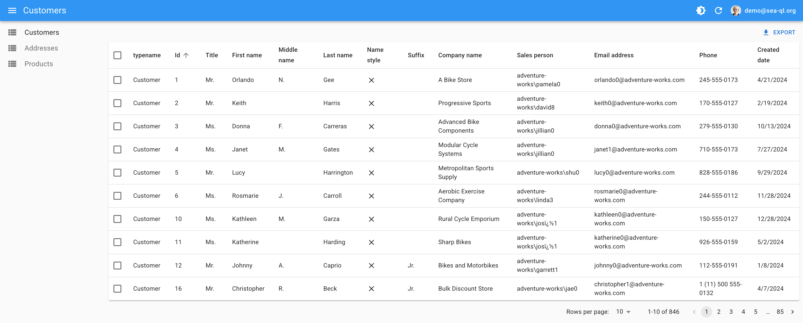
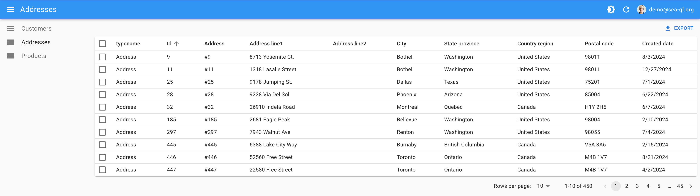

# React Admin Template for SeaORM Pro

This project is an open-source frontend template for [SeaORM Pro](https://github.com/SeaQL/sea-orm-pro), inspired by the closed-source SeaORM Pro Plus. It provides a ready-to-use [React Admin](https://marmelab.com/react-admin/) interface for managing your SeaORM Pro backend.

SeaORM Pro exposes two types of APIs:
- **RESTful**
- **GraphQL**

## Getting Started

### 1. Start the SeaORM Pro Backend

Clone the backend repository and start the server:

```
git clone https://github.com/SeaQL/sea-orm-pro
```

Verify the backend is running by checking these URLs:

- [http://localhost:8086/admin](http://localhost:8086/admin)
- [http://localhost:8086/api/graphql](http://localhost:8086/api/graphql)
- Test login API:
  ```
  curl 'http://localhost:8086/api/auth/login' \
    -H 'Content-Type: application/json' \
    --data-raw '{"password":"demo@sea-ql.org","email":"demo@sea-ql.org"}'
  ```

### 2. Start the Frontend

Clone this repository and start the development server:

```
git clone https://github.com/oizhaolei/sea-orm-pro-frontend-ra
yarn dev
```

Open [http://localhost:8085/](http://localhost:8085) in your browser and log in with:

- **Email:** demo@sea-ql.org  
- **Password:** demo@sea-ql.org

## Screenshots



